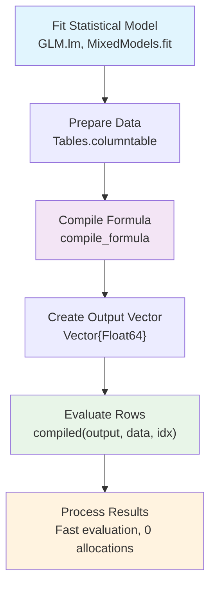
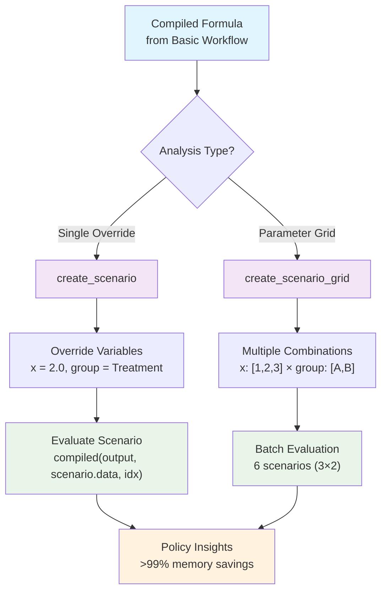
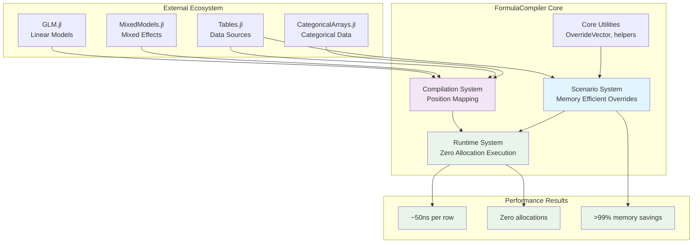
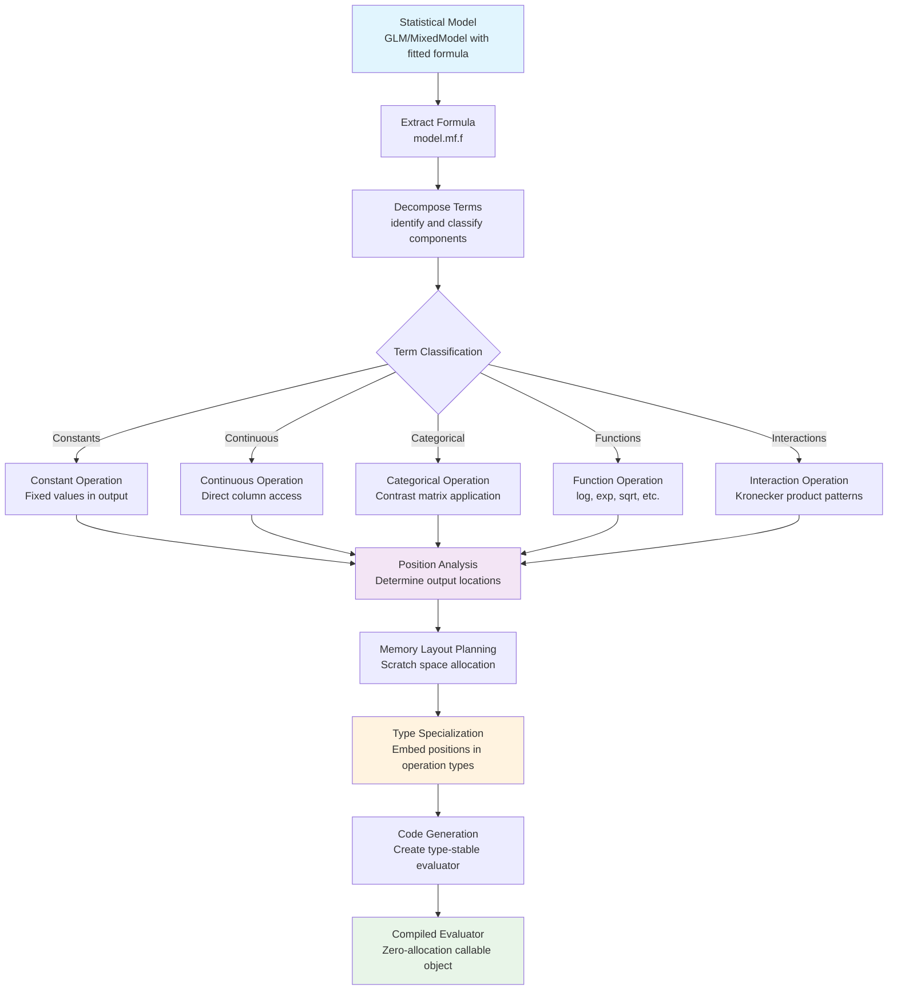
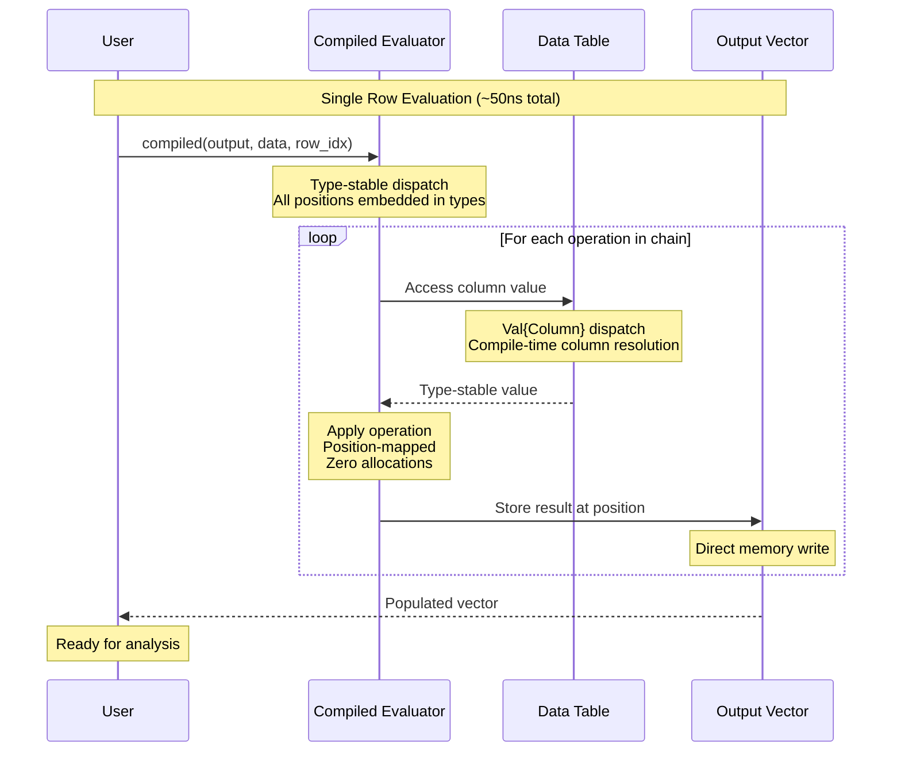
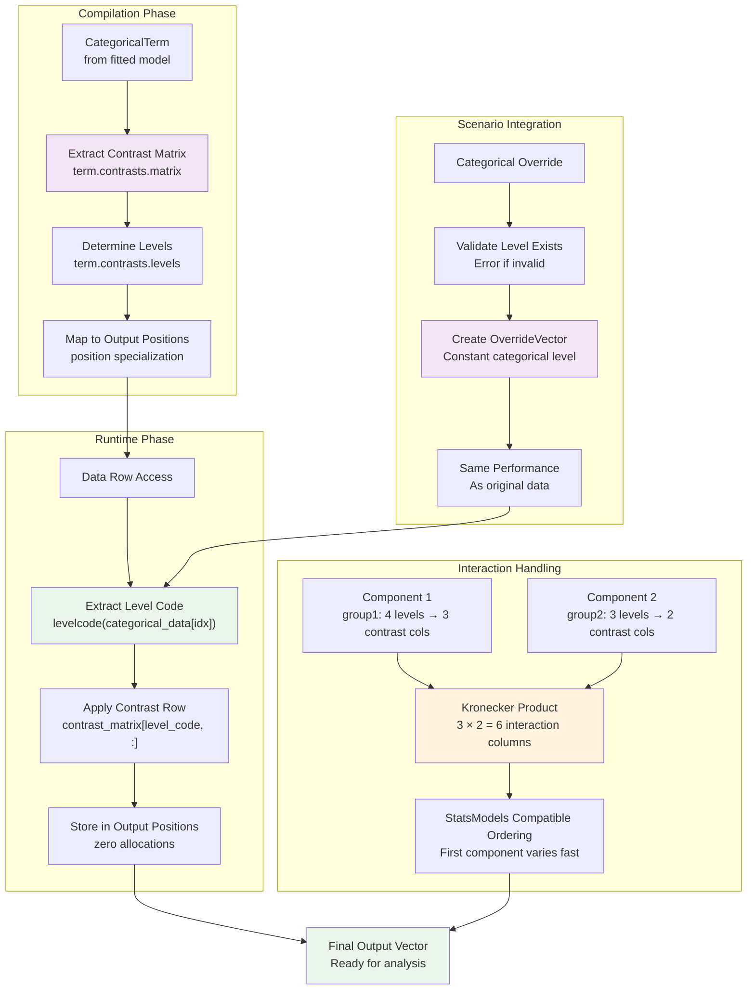

# FormulaCompiler.jl Visual Guide

This document contains the key diagrams illustrating FormulaCompiler.jl's design and usage patterns.

## User Workflow

### Basic Usage Flow
How to go from a fitted statistical model to fast, zero-allocation evaluation:



**Example Code:**
```julia
# Fit model
model = lm(@formula(y ~ x * group), df)

# Compile for fast evaluation  
data = Tables.columntable(df)
compiled = compile_formula(model, data)

# Zero-allocation evaluation
output = Vector{Float64}(undef, length(compiled))
compiled(output, data, 1)      # First row
compiled(output, data, 500)    # 500th row
```

### Scenario Analysis Workflow
How to use the override system for counterfactual analysis:



**Example Code:**
```julia
# Single scenario
scenario = create_scenario("treatment", data; x = 2.0, group = "Treatment")
compiled(output, scenario.data, 1)

# Parameter grid
grid = create_scenario_grid("sensitivity", data, Dict(
    :x => [1.0, 2.0, 3.0],
    :group => ["Control", "Treatment"]
))
# Automatically creates 6 scenarios with all combinations
```

## System Architecture

### High-Level Component Overview



## Technical Implementation

### Compilation Pipeline
How statistical formulas are transformed into zero-allocation evaluators:



### Runtime Execution Flow
Step-by-step process during evaluation:



## Categorical Variable Handling

### Complete Categorical System
How categorical variables and interactions are processed:



**Key Features:**
- **Perfect StatsModels compatibility**: Uses exact contrast matrices from fitted models
- **All contrast types supported**: DummyCoding, EffectsCoding, HelmertCoding, custom contrasts  
- **Efficient interactions**: Proper Kronecker product implementation with correct ordering
- **Scenario integration**: Categorical overrides work seamlessly with zero-allocation performance

## Performance Summary

FormulaCompiler.jl achieves exceptional performance through:

- **Position mapping**: All output locations determined at compile time
- **Type specialization**: Runtime decisions embedded in compile-time types  
- **Zero allocations**: No intermediate memory allocation during evaluation
- **Memory efficiency**: >99% savings for scenario analysis via OverrideVector
- **Ecosystem integration**: Perfect compatibility with Julia statistical packages

**Benchmark Results**: ~50ns per row, 0 allocations, 10-100x faster than `modelmatrix()[row, :]`