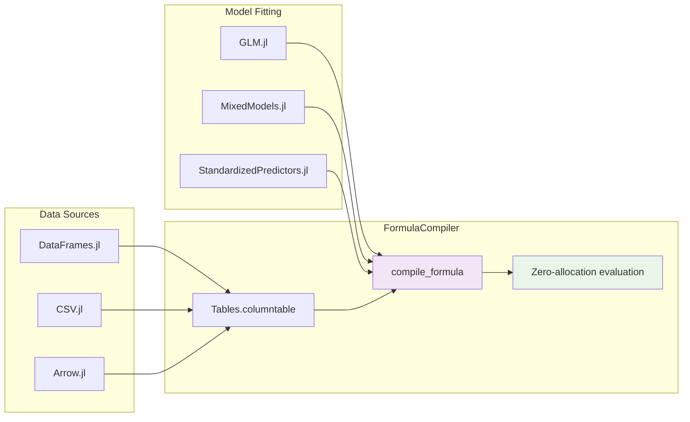
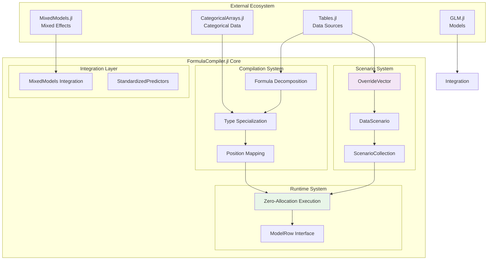
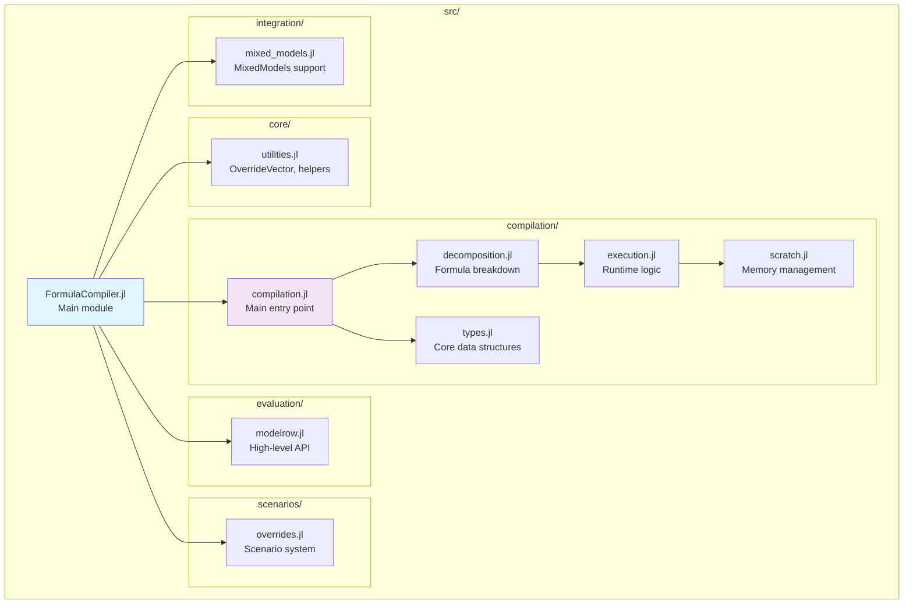
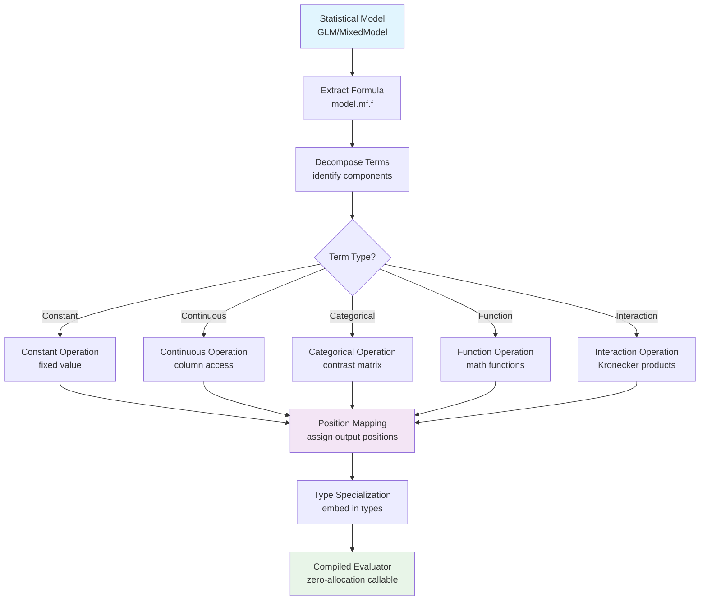
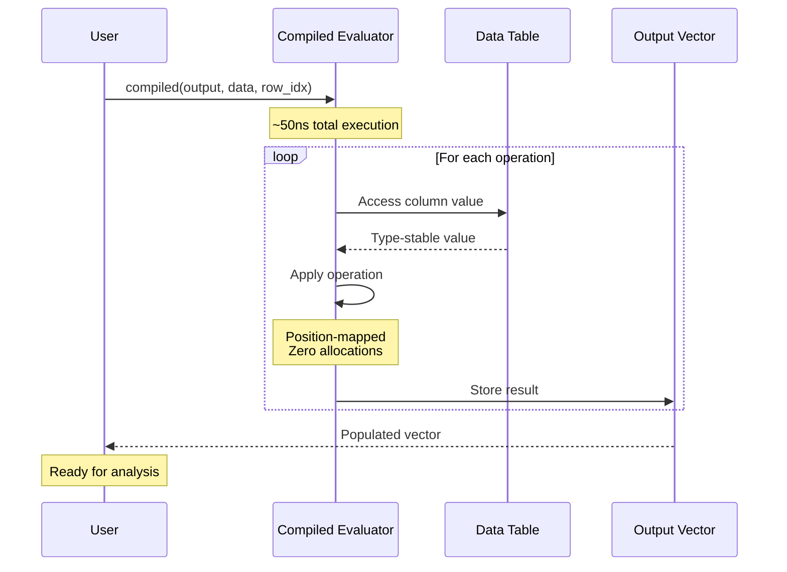

# Mermaid Diagram Plan for FormulaCompiler.jl

## Overview

This document outlines the planned Mermaid diagrams to illustrate both user workflows and internal architecture of FormulaCompiler.jl. These diagrams will enhance documentation by providing visual representations of the package's design and usage patterns.

## Diagram Categories

### 1. User Workflow Diagrams

#### A. Basic Usage Flow (`user_basic_workflow`)
**Purpose**: Show the standard user journey from model fitting to evaluation  
**Target audience**: New users learning the package  
**Content**:
```mermaid
flowchart TD
    A[Fit Statistical Model<br/>GLM/MixedModels] --> B[Prepare Data<br/>Tables.columntable]
    B --> C[Compile Formula<br/>compile_formula] 
    C --> D[Create Output Vector<br/>Vector{Float64}]
    D --> E[Evaluate Rows<br/>compiled(output, data, idx)]
    E --> F[Process Results<br/>~50ns per row, 0 allocations]
    
    style A fill:#e1f5fe
    style C fill:#f3e5f5
    style E fill:#e8f5e8
```

#### B. Scenario Analysis Workflow (`user_scenario_workflow`)
**Purpose**: Illustrate the scenario/override system usage  
**Target audience**: Users doing sensitivity analysis  
**Content**:
```mermaid
flowchart TD
    A[Compiled Formula] --> B{Analysis Type?}
    B -->|Single Override| C[create_scenario]
    B -->|Parameter Grid| D[create_scenario_grid]
    
    C --> E[Override Variables<br/>x = 2.0, group = "Treatment"]
    D --> F[Multiple Combinations<br/>x: [1,2,3] × group: [A,B]]
    
    E --> G[Evaluate Scenario<br/>compiled(output, scenario.data, idx)]
    F --> H[Batch Evaluation<br/>Multiple scenarios]
    
    G --> I[Compare Results]
    H --> I
    I --> J[Policy Analysis<br/>>99% memory savings]
    
    style A fill:#e1f5fe
    style C fill:#f3e5f5
    style D fill:#f3e5f5
    style J fill:#e8f5e8
```

#### C. Integration Workflow (`user_integration_workflow`)
**Purpose**: Show integration with Julia statistical ecosystem  
**Target audience**: Users integrating with existing workflows  
**Content**:


### 2. System Architecture Diagrams

#### A. High-Level Architecture (`system_architecture`)
**Purpose**: Show major system components and relationships  
**Target audience**: Developers understanding the codebase  
**Content**:


#### B. File Organization (`codebase_structure`)
**Purpose**: Visual map of source code organization  
**Target audience**: Contributors navigating the codebase  
**Content**:


### 3. Compilation Pipeline Diagrams

#### A. Compilation Process (`compilation_pipeline`)
**Purpose**: Detailed view of how formulas are compiled  
**Target audience**: Developers working on compilation system  
**Content**:


#### B. Runtime Execution Flow (`runtime_execution`)
**Purpose**: Show step-by-step evaluation process  
**Target audience**: Performance-focused developers  
**Content**:


### 4. Detailed Component Diagrams

#### A. Categorical System (`categorical_system`)
**Purpose**: Illustrate categorical variable handling  
**Target audience**: Users working with categorical data  
**Content**:
```mermaid
graph TD
    subgraph "Compilation Phase"
        A[CategoricalTerm] --> B[Extract Contrast Matrix<br/>term.contrasts.matrix]
        B --> C[Map to Output Positions<br/>position specialization]
    end
    
    subgraph "Runtime Phase"  
        D[Data Row] --> E[Extract Level Code<br/>levelcode(data[idx])]
        E --> F[Apply Contrast Row<br/>contrast_matrix[level, :]]
        F --> G[Store in Positions<br/>zero allocations]
    end
    
    subgraph "Interaction Handling"
        H[Component 1<br/>group1: 3 levels → 2 cols]
        I[Component 2<br/>group2: 4 levels → 3 cols]
        H --> J[Kronecker Product<br/>2 × 3 = 6 columns]
        I --> J
        J --> K[StatsModels Compatible<br/>ordering]
    end
    
    C --> D
    G --> Interaction
    K --> Output[Output Vector]
    
    style B fill:#f3e5f5
    style E fill:#e8f5e8
    style J fill:#fff3e0
```

#### B. Scenario System Architecture (`scenario_system`)
**Purpose**: Show override/scenario system design  
**Target audience**: Users doing counterfactual analysis  
**Content**:
```mermaid
graph TB
    subgraph "Override Primitives"
        OV[OverrideVector{T}<br/>Lazy constant vector<br/>O(1) memory]
        
        subgraph "OverrideVector Features"
            OV1[Any index → same value]
            OV2[Zero-allocation access]
            OV3[Type-stable iteration]
        end
        
        OV --> OV1
        OV --> OV2
        OV --> OV3
    end
    
    subgraph "Scenario Management"
        DS[DataScenario<br/>Individual scenario]
        SC[ScenarioCollection<br/>Batch operations]
        Grid[create_scenario_grid<br/>Parameter combinations]
        
        DS --> SC
        Grid --> SC
    end
    
    subgraph "Memory Efficiency"
        Orig[Original Data<br/>100MB DataFrame]
        Scenarios[1000 Scenarios<br/>~32KB total overhead]
        Savings[>99% Memory Savings]
        
        Orig --> Scenarios
        Scenarios --> Savings
    end
    
    OV --> DS
    DS --> Eval[Compiled Evaluator<br/>Same performance as original]
    SC --> Batch[Batch Evaluation<br/>Policy analysis]
    
    style OV fill:#f3e5f5
    style Savings fill:#e8f5e8
    style Grid fill:#fff3e0
```

### 5. Performance Architecture (`performance_system`)
**Purpose**: Visualize zero-allocation design  
**Target audience**: Performance-conscious developers  
**Content**:
```mermaid
graph TD
    subgraph "Compile Time (Expensive)"
        A[Formula Analysis] --> B[Position Mapping]
        B --> C[Type Specialization]
        C --> D[Memory Layout Planning]
    end
    
    subgraph "Runtime (Fast: ~50ns)"
        E[Type-Stable Dispatch] --> F[Direct Memory Access]
        F --> G[Fixed Position Writes]
        G --> H[Zero Allocations]
    end
    
    subgraph "Key Techniques"
        T1[Val{Column} dispatch<br/>Compile-time column access]
        T2[Position embedding<br/>Types carry positions]
        T3[Pre-computed layouts<br/>No runtime decisions]
        T4[Tuple-based operations<br/>Stack-allocated structures]
    end
    
    D --> E
    C --> T1
    B --> T2
    A --> T3
    H --> T4
    
    style D fill:#e1f5fe
    style H fill:#e8f5e8
    style T1 fill:#f3e5f5
```

## Implementation Priority

### Phase 1: Core Documentation (High Priority)
1. **user_basic_workflow** - Essential for README and getting started
2. **system_architecture** - Critical for CLAUDE.md and contributor onboarding  
3. **compilation_pipeline** - Core technical documentation

### Phase 2: User Features (Medium Priority)
4. **user_scenario_workflow** - Important for scenario system documentation
5. **categorical_system** - Valuable for categorical handling docs
6. **runtime_execution** - Good for performance documentation

### Phase 3: Advanced Details (Lower Priority)
7. **user_integration_workflow** - Nice for ecosystem integration docs
8. **codebase_structure** - Helpful for contributors
9. **scenario_system** - Detailed architecture documentation
10. **performance_system** - Advanced performance documentation

## Integration Plan

### Documentation Integration
- **README.md**: Embed `user_basic_workflow` and `system_architecture`
- **CLAUDE.md**: Include `compilation_pipeline` and `codebase_structure`
- **docs/**: Use specialized diagrams in relevant sections
- **categorical_handling.md**: Include `categorical_system`

### File Organization
```
docs/diagrams/
├── README.md                    # This file
├── user_workflows.mmd          # User-facing workflows
├── system_architecture.mmd     # High-level system design
├── compilation_detail.mmd      # Internal compilation process
├── categorical_system.mmd      # Categorical handling details
└── performance_system.mmd      # Performance architecture
```

### Maintenance Strategy
- **Keep diagrams in sync**: Update diagrams when architecture changes
- **Version in git**: Track diagram changes alongside code changes
- **Review process**: Include diagram updates in code review process
- **Testing**: Ensure examples in diagrams remain executable

## Next Steps

1. **Create Phase 1 diagrams** (user_basic_workflow, system_architecture, compilation_pipeline)
2. **Test integration** in README.md and CLAUDE.md  
3. **Gather feedback** from users/contributors
4. **Iterate and improve** based on feedback
5. **Expand to Phase 2** diagrams as needed

This plan provides a comprehensive visual documentation strategy that will significantly enhance the package's accessibility and maintainability.