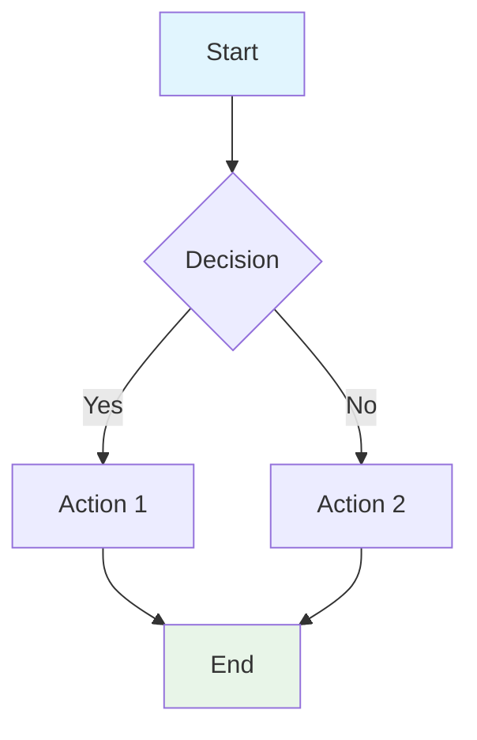
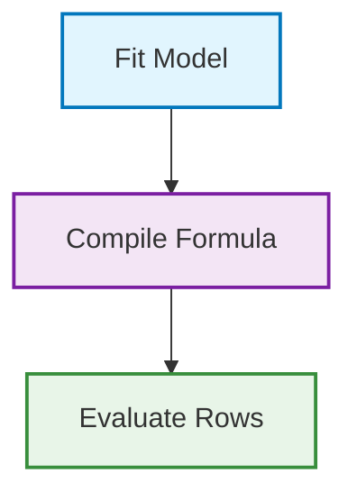
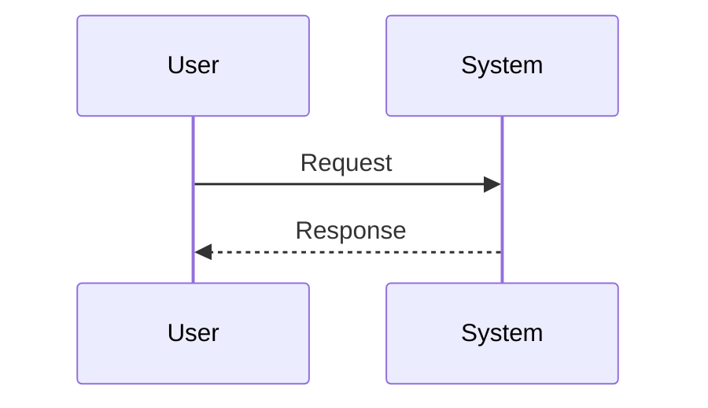

# Diagram Rendering Test

Let's test if Mermaid diagrams render properly in this repository.

## Test 1: Simple Flowchart

## Test 2: Basic User Workflow

## Test 3: Sequence Diagram

If you can see these diagrams rendered (not just the code), then Mermaid is working correctly in this repository.