# FormulaCompiler.jl Diagrams

This directory contains Mermaid diagrams illustrating the design and usage of FormulaCompiler.jl.

## Phase 1 Diagrams (Completed)

### User Basic Workflow
**File**: `user_basic_workflow.mmd`  
**Purpose**: Shows the standard user journey from model fitting to evaluation  
**Target audience**: New users learning the package



### System Architecture
**File**: `system_architecture.mmd`  
**Purpose**: Shows major system components and relationships  
**Target audience**: Developers understanding the codebase

### Compilation Pipeline
**File**: `compilation_pipeline.mmd`  
**Purpose**: Detailed view of how formulas are compiled  
**Target audience**: Developers working on compilation system

## Usage

### In Documentation
To include a diagram in markdown files:

```markdown
```mermaid
<!-- Copy content from .mmd file -->
```

### In GitHub
These diagrams will render automatically when viewing .mmd files or when embedded in markdown files on GitHub.

### Local Rendering
To preview diagrams locally, you can use:
- Mermaid Live Editor: https://mermaid.live/
- VS Code with Mermaid extension
- Any markdown preview that supports Mermaid

## Phase 2 Diagrams (Completed)

### User Scenario Workflow
**File**: `user_scenario_workflow.mmd`  
**Purpose**: Illustrate the scenario/override system usage  
**Target audience**: Users doing sensitivity analysis



### Categorical System
**File**: `categorical_system.mmd`  
**Purpose**: Detailed view of categorical variable handling  
**Target audience**: Users working with categorical data and developers

### Runtime Execution Flow
**File**: `runtime_execution.mmd`  
**Purpose**: Step-by-step evaluation process with performance details  
**Target audience**: Performance-focused developers

## Phase 3 Diagrams (Future)

**Planned diagrams**:
- Integration workflows
- Performance architecture  
- Advanced scenario features
- Codebase structure navigation

