# Architecture

Technical overview of FormulaCompiler.jl’s unified, zero‑allocation compilation and execution model.

## Design Philosophy

Move expensive work to compile time; keep runtime simple and type‑stable.

- Compile‑time specialization: All positions and operations are baked into types
- Type stability: No dynamic dispatch in hot paths
- Memory reuse: Preallocate once; reuse across evaluations
- Position mapping: Address everything by compile‑time positions, not names

## System Overview



## Unified Compilation Pipeline

The compilation process transforms statistical formulas into optimized evaluators:


Compilation produces a single position‑mapped evaluator (`UnifiedCompiled`) in four steps:

1) Decompose terms → operations
- Parse the schema‑applied formula and convert into primitive ops:
  - `LoadOp`, `ConstantOp`, `UnaryOp`, `BinaryOp`, `ContrastOp`, `CopyOp`

2) Allocate positions
- Assign scratch positions for intermediates and indices for final outputs
- Cache term → position mapping to reuse computed intermediates

3) Specialize operation types
- Embed positions and keys as type parameters (e.g., `LoadOp{:x, 3}`)
- Convert op vector to a tuple for type‑stable execution

4) Package into `UnifiedCompiled`
- Store op tuple and a preallocated scratch buffer sized to maximum position
- Provide a callable that writes directly into a user‑supplied output vector

Result: `compiled(row_vec, data, row)` runs in tens of nanoseconds with 0 allocations after warmup (typical; see Benchmark Protocol).

## Operation Set

Primitive operations form an acyclic execution plan:

- `LoadOp{Column, OutPos}`: data[column][row] → scratch[OutPos]
- `ConstantOp{Value, OutPos}`: literal → scratch[OutPos]
- `UnaryOp{Func, InPos, OutPos}`: f(scratch[InPos]) → scratch[OutPos]
- `BinaryOp{Func, In1, In2, OutPos}`: f(scratch[In1], scratch[In2]) → scratch[OutPos]
- `ContrastOp{Column, OutPositions}`: categorical expansion → scratch[each(OutPositions)]
- `CopyOp{InPos, OutIdx}`: scratch[InPos] → output[OutIdx]

All operation ordering respects dependencies to ensure each input is ready when used.

## Zero‑Allocation Execution

Runtime evaluation is pure array indexing with concrete types:

- Scratch: `Vector{Float64}(undef, ScratchSize)` allocated once inside `UnifiedCompiled`
- Output: Provided by the caller; must have length `length(compiled)`
- Execution: Iterate the typed op tuple and update scratch/output in place

Path to zero allocations:
- Preallocate scratch once per compiled formula
- No temporary arrays or dynamic dispatch during execution
- Column access uses direct field lookup from a NamedTuple (column table)

For complex formulas (>25 operations) and derivative computation, the system uses targeted metaprogramming to maintain zero-allocation performance. See [Metaprogramming](metaprogramming.md) for implementation details.

## Memory & Scenarios

- `OverrideVector`: Lazy constant vectors for scenario overrides (~32 bytes)
- `DataScenario`: Wraps a base dataset plus overrides without copying columns
- `create_scenario_grid`: Generate large scenario sets efficiently

## Integration

- GLM.jl: Works with all linear and generalized linear models
- MixedModels.jl: Automatically extracts fixed‑effects formula via `fixed_effects_form`
- StandardizedPredictors.jl: ZScore standardization supported at compile time

## Extensibility

Add an operation or transformation by composing existing ops during decomposition, or extend model support via dispatch that extracts a StatsModels `@formula` and delegates to the unified compiler.

## Performance Monitoring

Check allocations and timings with BenchmarkTools:

```julia
@allocated compiled(row_vec, data, 1)  # Expect 0
@benchmark $compiled($row_vec, $data, 1)
```

Figure generation
- During docs builds, diagrams under `docs/src/assets/*.mmd` are automatically regenerated to SVG if the Mermaid CLI (`mmdc`) is available (see `docs/make.jl`).

## Future Directions

- Parallel row evaluation for batches
- Expanded function library and transformations
- AD‑friendly derivatives and sensitivity analysis
- Streaming and distributed execution patterns
