# Getting Started

This guide will walk you through the basics of using FormulaCompiler.jl for efficient model matrix evaluation.

## Installation

FormulaCompiler.jl is currently available from GitHub:

```julia
using Pkg
Pkg.add(url="https://github.com/emfeltham/FormulaCompiler.jl")
```

Once installed, you can load the package:

## Workflow Overview

Here's how FormulaCompiler.jl works from start to finish:



```julia
using FormulaCompiler
```

## Basic Workflow

The typical workflow with FormulaCompiler.jl involves three steps:

1. **Fit your model** using standard Julia statistical packages
2. **Compile the formula** for optimized evaluation
3. **Evaluate rows** with zero allocations

Let's walk through a complete example:

### Step 1: Fit Your Model

```julia
using FormulaCompiler, GLM, DataFrames, Tables, CategoricalArrays

# Create some sample data
df = DataFrame(
    y = randn(1000),
    x = randn(1000),
    z = abs.(randn(1000)) .+ 0.1,
    group = categorical(rand(["A", "B", "C"], 1000)),
    treatment = rand(Bool, 1000)
)

# Fit a model using GLM.jl (or any compatible package)
model = lm(@formula(y ~ x * group + log(z) + treatment), df)
```

> **Important**: FormulaCompiler requires all categorical variables to use `CategoricalArrays.jl`. String variables in models are not supported. Always convert string columns to categorical format using `categorical(column)` before model fitting.

### Step 2: Compile the Formula

Convert your data to column-table format for best performance:

```julia
data = Tables.columntable(df)
```

Compile the formula:

```julia
compiled = compile_formula(model, data)
```

The compiled formula contains all the information needed for zero-allocation evaluation.

### Step 3: Evaluate Rows

Pre-allocate an output vector:

```julia
row_vec = Vector{Float64}(undef, length(compiled))
```

Now evaluate any row with zero allocations:

```julia
compiled(row_vec, data, 1)    # Evaluate row 1
compiled(row_vec, data, 100)  # Evaluate row 100
compiled(row_vec, data, 500)  # Evaluate row 500
```

Each call achieves zero allocations with good performance.

## Alternative Interfaces

FormulaCompiler.jl provides several interfaces for different use cases:

### Convenient Interface (Allocating)

For quick prototyping or when allocation performance isn't critical:

```julia
# Single row evaluation
row_values = modelrow(model, data, 1)

# Multiple rows
row_indices = [1, 10, 50, 100]
matrix = modelrow(model, data, row_indices)
```

### Object-Based Interface

Create a reusable evaluator object:

```julia
evaluator = ModelRowEvaluator(model, df)

# Zero-allocation evaluation
result = evaluator(1)           # Returns new vector
evaluator(row_vec, 1)          # In-place evaluation
```

### Batch Evaluation

Evaluate multiple rows at once:

```julia
# Pre-allocate matrix
matrix = Matrix{Float64}(undef, 10, length(compiled))

# Evaluate rows 1-10 in batch
modelrow!(matrix, compiled, data, 1:10)
```

## How Compilation Works

FormulaCompiler.jl uses a unified compilation pipeline based on position mapping:

1. Decompose the formula into primitive operations (load, constant, unary, binary, contrast, copy)
2. Allocate scratch and output positions for all intermediate and final values
3. Embed those positions as compile-time type parameters
4. Return a `UnifiedCompiled` object that evaluates rows with zero allocations

## Performance Verification

You can verify zero-allocation performance using BenchmarkTools.jl:

```julia
using BenchmarkTools

# Benchmark the zero-allocation interface
@benchmark $compiled($row_vec, $data, 1)
```

You should see zero allocations and good evaluation performance. Absolute times vary by hardware and Julia version; focus on allocation behavior and relative trends. See the Benchmark Protocol for reproduction details:
```
BenchmarkTools.Trial: Many samples with many evaluations.
 Memory estimate: 0 bytes, allocs estimate: 0.
```

Compare this to the traditional approach:

```julia
@benchmark modelmatrix($model)[1, :]
```

## Troubleshooting

### Common Issues and Solutions

#### Compilation Errors

**Problem**: `MethodError` during `compile_formula`
```julia
# Error: MethodError: no method matching compile_formula(::SomeUnsupportedModel, ::NamedTuple)
```

**Solution**: Ensure you're using a supported model type (GLM, MixedModels) or check package compatibility.

**Problem**: `BoundsError` or dimension mismatches
```julia
# Error: BoundsError: attempt to access 500-element Vector at index [1001]
```

**Solution**: Verify that your data contains the expected number of rows and that `row_idx` is within bounds.

#### Performance Issues

**Problem**: Non-zero allocations detected
```julia
# @benchmark shows non-zero memory allocations
```

**Solutions**:
1. Use `Tables.columntable(df)` instead of DataFrame directly
2. Ensure output vector is pre-allocated with correct size
3. Check for type instabilities in your data (mixed types in columns)
4. Verify all categorical variables use `CategoricalArrays.jl`

**Problem**: Slower than expected performance
```julia
# Evaluation takes longer than anticipated
```

**Solutions**:
1. Let compilation warm up with a few calls before benchmarking
2. Use the caching interface (`modelrow!` with cache=true) for repeated evaluations
3. Check for complex formulas that may benefit from simplification
4. Ensure data is in optimal format (`Tables.columntable`)

#### Data Format Issues

**Problem**: String variables in models
```julia
# Error: FormulaCompiler does not support raw string variables
df.category = ["A", "B", "C", "A", "B"]  # String vector
model = lm(@formula(y ~ x + category), df)  # Will cause issues
```

**Solution**: Convert all categorical data to `CategoricalArrays.jl` format before model fitting:
```julia
# Required: Convert strings to categorical
df.category = categorical(df.category)
model = lm(@formula(y ~ x + category), df)  # Now works correctly
```

**Problem**: Categorical contrasts or unexpected behavior
```julia
# Error with categorical contrasts or unexpected contrast behavior
```

**Solutions**:
1. Ensure all categorical variables use `CategoricalArrays.jl`: `categorical(column)`
2. Verify factor levels are consistent between training and evaluation data
3. Check contrast specifications in model fitting: `contrasts = Dict(:var => EffectsCoding())`

**Problem**: Missing values causing errors
```julia
# Error: missing values not supported
```

**Solution**: Remove or impute missing values before model fitting and compilation.

#### Memory Issues

**Problem**: Large memory usage despite zero-allocation claims
```julia
# High memory usage in application
```

**Solutions**:
1. Use scenario system instead of creating multiple data copies
2. Reuse compiled formulas rather than recompiling
3. Clear model cache if accumulating many different compilations: `clear_model_cache!()`

### Performance Validation

Verify your setup achieves expected performance:

```julia
using BenchmarkTools

# Check zero allocations
result = @benchmark $compiled($row_vec, $data, 1)
@assert result.memory == 0 "Expected zero allocations, got $(result.memory) bytes"

# Check cache effectiveness  
@time modelrow!(row_vec, model, data, 1; cache=true)  # First call
@time modelrow!(row_vec, model, data, 2; cache=true)  # Should be much faster
```

### Getting Help

If you encounter issues not covered here:

1. Check the [API Reference](api.md) for detailed function documentation
2. Review [Examples](examples.md) for similar use cases
3. Examine [Advanced Features](guide/advanced_features.md) for complex scenarios
4. Consult [Performance Tips](guide/performance.md) for optimization guidance

## Interface Selection Guide

Choose the right interface for your needs:

### Use `compiled(output, data, row_idx)` when:
- Maximum performance is critical
- You're in tight computational loops
- You can manage pre-allocation
- Zero allocations are required

### Use `modelrow!(output, compiled, data, row_idx)` when:
- You want explicit control over compilation
- You need the same compiled formula across different data
- Memory management is important
- You prefer functional over object-oriented style

### Use `modelrow(model, data, row_idx)` when:
- Convenience outweighs performance
- You're prototyping or exploring
- Allocation overhead is acceptable
- You prefer simple, direct interfaces

### Use `ModelRowEvaluator(model, data)` when:
- You prefer object-oriented interfaces
- The same model and data are used repeatedly
- You need both allocating and non-allocating evaluation
- You want encapsulated state management

## What's Next?

Now that you understand the basics, explore advanced topics:

### Immediate Next Steps
- [Basic Usage Guide](guide/basic_usage.md) - Detailed interface documentation
- [Scenario Analysis](guide/scenarios.md) - Counterfactual analysis and variable overrides
- [Performance Tips](guide/performance.md) - Optimization strategies

### Advanced Applications  
- [Examples](examples.md) - Real-world statistical computing patterns
- [GLM Integration](integration/glm.md) - Linear and generalized linear model workflows
- [MixedModels Integration](integration/mixed_models.md) - Mixed-effects model support

### Reference Documentation
- [API Reference](../api.md) - Complete function documentation with examples
- [Architecture](../architecture.md) - Implementation details and design principles  
- [Mathematical Foundation](../mathematical_foundation.md) - Theoretical background and computational theory
