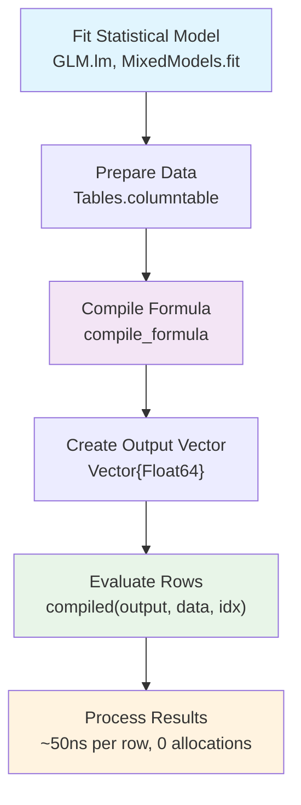

# Getting Started

This guide will walk you through the basics of using FormulaCompiler.jl to achieve zero-allocation model matrix evaluation.

## Installation

FormulaCompiler.jl is currently available from GitHub:

```julia
using Pkg
Pkg.add(url="https://github.com/emfeltham/FormulaCompiler.jl")
```

Once installed, you can load the package:

## Workflow Overview

Here's how FormulaCompiler.jl works from start to finish:



```julia
using FormulaCompiler
```

## Basic Workflow

The typical workflow with FormulaCompiler.jl involves three steps:

1. **Fit your model** using standard Julia statistical packages
2. **Compile the formula** for optimized evaluation
3. **Evaluate rows** with zero allocations

Let's walk through a complete example:

### Step 1: Fit Your Model

```julia
using FormulaCompiler, GLM, DataFrames, Tables, CategoricalArrays

# Create some sample data
df = DataFrame(
    y = randn(1000),
    x = randn(1000),
    z = abs.(randn(1000)) .+ 0.1,
    group = categorical(rand(["A", "B", "C"], 1000)),
    treatment = rand(Bool, 1000)
)

# Fit a model using GLM.jl (or any compatible package)
model = lm(@formula(y ~ x * group + log(z) + treatment), df)
```

### Step 2: Compile the Formula

Convert your data to column-table format for best performance:

```julia
data = Tables.columntable(df)
```

Compile the formula:

```julia
compiled = compile_formula(model, data)
```

The compiled formula contains all the information needed for zero-allocation evaluation.

### Step 3: Evaluate Rows

Pre-allocate an output vector:

```julia
row_vec = Vector{Float64}(undef, length(compiled))
```

Now evaluate any row with zero allocations:

```julia
compiled(row_vec, data, 1)    # Evaluate row 1
compiled(row_vec, data, 100)  # Evaluate row 100
compiled(row_vec, data, 500)  # Evaluate row 500
```

Each call takes ~50ns and allocates 0 bytes!

## Alternative Interfaces

FormulaCompiler.jl provides several interfaces for different use cases:

### Convenient Interface (Allocating)

For quick prototyping or when allocation performance isn't critical:

```julia
# Single row evaluation
row_values = modelrow(model, data, 1)

# Multiple rows
row_indices = [1, 10, 50, 100]
matrix = modelrow(model, data, row_indices)
```

### Object-Based Interface

Create a reusable evaluator object:

```julia
evaluator = ModelRowEvaluator(model, df)

# Zero-allocation evaluation
result = evaluator(1)           # Returns new vector
evaluator(row_vec, 1)          # In-place evaluation
```

### Batch Evaluation

Evaluate multiple rows at once:

```julia
# Pre-allocate matrix
matrix = Matrix{Float64}(undef, 10, length(compiled))

# Evaluate rows 1-10 in batch
modelrow!(matrix, compiled, data, 1:10)
```

## How Compilation Works

FormulaCompiler.jl uses a unified compilation pipeline based on position mapping:

1. Decompose the formula into primitive operations (load, constant, unary, binary, contrast, copy)
2. Allocate scratch and output positions for all intermediate and final values
3. Embed those positions as compile-time type parameters
4. Return a `UnifiedCompiled` object that evaluates rows with zero allocations

## Performance Verification

You can verify zero-allocation performance using BenchmarkTools.jl:

```julia
using BenchmarkTools

# Benchmark the zero-allocation interface
@benchmark $compiled($row_vec, $data, 1)
```

You should see output like:
```
BenchmarkTools.Trial: 10000 samples with 1000 evaluations.
 Range (min … max):  45.123 ns … 67.891 ns  ┊ GC (min … max): 0.00% … 0.00%
 Time  (median):     48.456 ns               ┊ GC (median):    0.00%
 Time  (mean ± σ):   49.234 ns ±  2.345 ns  ┊ GC (mean ± σ):  0.00% ± 0.00%
 Memory estimate: 0 bytes, allocs estimate: 0.
```

Compare this to the traditional approach:

```julia
@benchmark modelmatrix($model)[1, :]
```

## What's Next?

Now that you understand the basics, you can explore:

- [Advanced Features](guide/advanced_features.md) - Scenario analysis and memory optimization
- [Performance Tips](guide/performance.md) - Getting the most out of FormulaCompiler.jl
- [Examples](examples.md) - Real-world use cases and patterns
- [API Reference](api.md) - Complete function documentation
