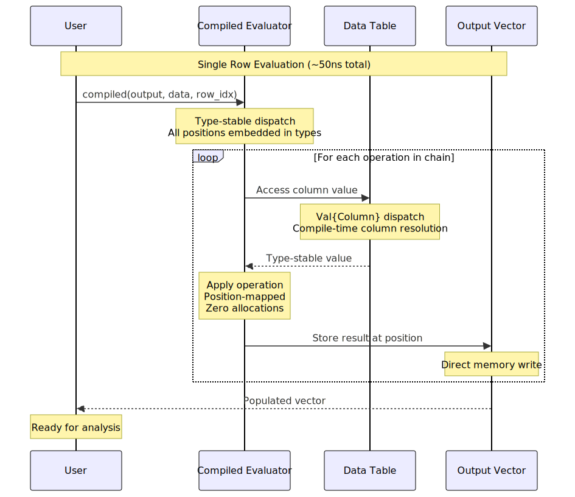

# Performance Tips

This guide covers best practices for achieving maximum performance with FormulaCompiler.jl.

## Core Performance Principles

FormulaCompiler.jl achieves zero-allocation performance through:
1. **Compile-time specialization**: Move expensive computations to compile time
2. **Type stability**: Ensure all operations are type-predictable
3. **Memory reuse**: Pre-allocate and reuse output vectors
4. **Efficient data structures**: Use column tables for optimal access patterns

## Runtime Execution Flow

Here's what happens during each ~50ns evaluation:



## Pre-compilation Best Practices

### Compile Once, Use Many Times

```julia
# Good: Compile once
compiled = compile_formula(model, data)
row_vec = Vector{Float64}(undef, length(compiled))

# Use many times (zero allocations)
for i in 1:1_000_000
    compiled(row_vec, data, i % nrow(data) + 1)
    # Process result...
end

# Bad: Compile every time
for i in 1:1_000_000
    result = modelrow(model, data, i % nrow(data) + 1)  # Compiles AND allocates!
end
```

### Data Format Optimization

```julia
using Tables, DataFrames

df = DataFrame(x = randn(10000), y = randn(10000))

# Best: Column table format
data = Tables.columntable(df)  # Convert once
compiled = compile_formula(model, data)

# Good: Direct DataFrame (but slower)
compiled = compile_formula(model, df)

# Benchmark the difference
using BenchmarkTools

@benchmark $compiled($row_vec, $data, 1)        # Fastest
@benchmark $compiled($row_vec, $df, 1)          # Slower due to column access
```

## Memory Management

### Pre-allocation Strategies

```julia
# Pre-allocate output vectors
compiled = compile_formula(model, data)
row_vec = Vector{Float64}(undef, length(compiled))

# For batch processing
n_rows = 1000
batch_matrix = Matrix{Float64}(undef, n_rows, length(compiled))

# Reuse across operations
for batch_start in 1:n_rows:total_rows
    batch_end = min(batch_start + n_rows - 1, total_rows)
    batch_size = batch_end - batch_start + 1
    
    # Use view for variable batch sizes
    batch_view = view(batch_matrix, 1:batch_size, :)
    modelrow!(batch_view, compiled, data, batch_start:batch_end)
end
```

### Memory Layout Optimization

```julia
# For repeated operations on the same rows
function optimized_repeated_evaluation(compiled, data, row_indices, n_repetitions)
    n_rows = length(row_indices)
    n_cols = length(compiled)
    
    # Pre-allocate everything
    results = Array{Float64, 3}(undef, n_repetitions, n_rows, n_cols)
    row_vec = Vector{Float64}(undef, n_cols)
    
    for rep in 1:n_repetitions
        for (i, row_idx) in enumerate(row_indices)
            compiled(row_vec, data, row_idx)
            results[rep, i, :] .= row_vec
        end
    end
    
    return results
end
```

## Benchmarking and Profiling

### Basic Performance Testing

```julia
using BenchmarkTools

function benchmark_formula_compilation(model, data)
    # Benchmark compilation
    compilation_time = @benchmark compile_formula($model, $data)
    
    # Benchmark evaluation
    compiled = compile_formula(model, data)
    row_vec = Vector{Float64}(undef, length(compiled))
    
    evaluation_time = @benchmark $compiled($row_vec, $data, 1)
    
    return (compilation = compilation_time, evaluation = evaluation_time)
end

# Run benchmark
results = benchmark_formula_compilation(model, data)
println("Compilation: ", results.compilation)
println("Evaluation: ", results.evaluation)
```

### Allocation Detection

```julia
function check_zero_allocations(compiled, data, n_tests=1000)
    row_vec = Vector{Float64}(undef, length(compiled))
    
    # Warm up
    compiled(row_vec, data, 1)
    
    # Test for allocations
    allocs_before = Base.gc_alloc_count()
    
    for i in 1:n_tests
        compiled(row_vec, data, i % nrow(data) + 1)
    end
    
    allocs_after = Base.gc_alloc_count()
    
    if allocs_after > allocs_before
        @warn "Detected $(allocs_after - allocs_before) allocations in $n_tests evaluations"
    else
        println("✓ Zero allocations confirmed for $n_tests evaluations")
    end
end

check_zero_allocations(compiled, data)
```

### Performance Profiling

```julia
using Profile, ProfileView

function profile_performance(compiled, data, n_evaluations=100_000)
    row_vec = Vector{Float64}(undef, length(compiled))
    
    # Profile execution
    Profile.clear()
    @profile begin
        for i in 1:n_evaluations
            compiled(row_vec, data, i % nrow(data) + 1)
        end
    end
    
    # Analyze results
    ProfileView.view()  # Opens interactive profile viewer
end
```

## Formula-Specific Optimizations

### Simple vs Complex Formulas

```julia
# Simple formulas are fastest
simple_model = lm(@formula(y ~ x + z), df)
simple_compiled = compile_formula(simple_model, data)

# Complex formulas still achieve zero allocation but are slower
complex_model = lm(@formula(y ~ x * group * treatment + log(z) + sqrt(abs(w))), df)
complex_compiled = compile_formula(complex_model, data)

# Benchmark both
@benchmark $simple_compiled($row_vec, $data, 1)
@benchmark $complex_compiled($row_vec, $data, 1)
```

### Categorical Variable Optimization

```julia
using CategoricalArrays

# Ordered categoricals can be more efficient
df.ordered_group = categorical(df.group, ordered=true)

# Use efficient contrast coding
contrasts_dict = Dict(:group => DummyCoding())
model_with_contrasts = lm(@formula(y ~ x + group), df, contrasts=contrasts_dict)
```

### Function Optimization Tips

```julia
# Some functions are more efficient than others
fast_functions = [
    @formula(y ~ log(x)),      # Fast
    @formula(y ~ exp(x)),      # Fast
    @formula(y ~ sqrt(x)),     # Fast
    @formula(y ~ x^2),         # Fast
    @formula(y ~ abs(x))       # Fast
]

slower_functions = [
    @formula(y ~ sin(x)),      # Slower
    @formula(y ~ cos(x)),      # Slower
    @formula(y ~ x^3.5)        # Slower (non-integer powers)
]
```

## Large Dataset Strategies

### Chunked Processing

```julia
function process_large_dataset_efficiently(model, data, chunk_size=10_000)
    compiled = compile_formula(model, data)
    n_rows = Tables.rowcount(data)
    n_cols = length(compiled)
    
    # Pre-allocate chunk matrix
    chunk_matrix = Matrix{Float64}(undef, chunk_size, n_cols)
    
    results = Vector{Matrix{Float64}}()
    
    for start_idx in 1:chunk_size:n_rows
        end_idx = min(start_idx + chunk_size - 1, n_rows)
        actual_chunk_size = end_idx - start_idx + 1
        
        # Use view for variable chunk sizes
        chunk_view = view(chunk_matrix, 1:actual_chunk_size, :)
        
        # Zero-allocation batch evaluation
        modelrow!(chunk_view, compiled, data, start_idx:end_idx)
        
        # Store results (this allocates, but unavoidable for storage)
        push!(results, copy(chunk_view))
    end
    
    return results
end
```

### Parallel Processing

```julia
using Distributed

@everywhere using FormulaCompiler

function parallel_formula_evaluation(model, data, row_indices)
    # Compile on each worker
    compiled = compile_formula(model, data)
    
    # Distributed evaluation
    results = @distributed (vcat) for row_idx in row_indices
        row_vec = Vector{Float64}(undef, length(compiled))
        compiled(row_vec, data, row_idx)
        row_vec'  # Return as row matrix
    end
    
    return results
end
```

## Optimization Anti-patterns

### What NOT to Do

```julia
# DON'T: Recompile in loops
for i in 1:1000
    result = modelrow(model, data, i)  # Recompiles every time!
end

# DON'T: Use DataFrames for row access in tight loops
for i in 1:1000
    compiled(row_vec, df, i)  # Slower than column table
end

# DON'T: Forget to pre-allocate
results = []
for i in 1:1000
    compiled(row_vec, data, i)
    push!(results, copy(row_vec))  # Allocates and copies!
end

# DON'T: Create unnecessary temporary arrays
for i in 1:1000
    compiled(row_vec, data, i)
    result = row_vec .+ 1.0  # Allocates new array!
end
```

### Better Alternatives

```julia
# DO: Compile once, pre-allocate, reuse
compiled = compile_formula(model, data)
data_table = Tables.columntable(df)
row_vec = Vector{Float64}(undef, length(compiled))
results = Matrix{Float64}(undef, 1000, length(compiled))

for i in 1:1000
    compiled(row_vec, data_table, i)
    results[i, :] .= row_vec  # In-place assignment
end

# DO: Use broadcasting for transformations
results .+= 1.0  # In-place broadcasting
```

## Performance Monitoring

### Continuous Performance Testing

```julia
function performance_regression_test(model, data, target_time_ns=100)
    compiled = compile_formula(model, data)
    row_vec = Vector{Float64}(undef, length(compiled))
    
    # Warm up
    compiled(row_vec, data, 1)
    
    # Time single evaluation
    time_ns = @elapsed begin
        for _ in 1:1000
            compiled(row_vec, data, 1)
        end
    end * 1e9 / 1000  # Convert to ns per evaluation
    
    if time_ns > target_time_ns
        @warn "Performance regression detected: $(round(time_ns))ns > $(target_time_ns)ns"
    else
        println("✓ Performance target met: $(round(time_ns))ns ≤ $(target_time_ns)ns")
    end
    
    return time_ns
end
```

### Memory Usage Monitoring

```julia
function memory_usage_test(model, data)
    # Measure compilation memory
    compilation_memory = @allocated compile_formula(model, data)
    
    # Measure evaluation memory
    compiled = compile_formula(model, data)
    row_vec = Vector{Float64}(undef, length(compiled))
    
    evaluation_memory = @allocated compiled(row_vec, data, 1)
    
    println("Compilation memory: $(compilation_memory) bytes")
    println("Evaluation memory: $(evaluation_memory) bytes")
    
    if evaluation_memory > 0
        @warn "Non-zero allocation in evaluation: $(evaluation_memory) bytes"
    end
    
    return (compilation = compilation_memory, evaluation = evaluation_memory)
end
```

## Real-world Performance Examples

### Monte Carlo Simulation

```julia
function efficient_monte_carlo(model, data, n_simulations=1_000_000)
    compiled = compile_formula(model, data)
    row_vec = Vector{Float64}(undef, length(compiled))
    results = Vector{Float64}(undef, n_simulations)
    
    # Pre-compute random indices
    row_indices = rand(1:nrow(data), n_simulations)
    
    @time begin
        for i in 1:n_simulations
            compiled(row_vec, data, row_indices[i])
            results[i] = some_statistic(row_vec)  # Your analysis function
        end
    end
    
    return results
end
```

### Bootstrap Resampling

```julia
function efficient_bootstrap(model, data, n_bootstrap=1000)
    compiled = compile_formula(model, data)
    n_rows = nrow(data)
    n_cols = length(compiled)
    
    bootstrap_results = Matrix{Float64}(undef, n_bootstrap, n_cols)
    row_vec = Vector{Float64}(undef, n_cols)
    
    for boot in 1:n_bootstrap
        # Generate bootstrap sample indices
        sample_indices = rand(1:n_rows, n_rows)
        
        # Compute bootstrap statistic
        for (i, row_idx) in enumerate(sample_indices)
            compiled(row_vec, data, row_idx)
            if i == 1
                bootstrap_results[boot, :] .= row_vec
            else
                bootstrap_results[boot, :] .+= row_vec
            end
        end
        
        bootstrap_results[boot, :] ./= n_rows  # Average
    end
    
    return bootstrap_results
end
```

## Summary

Key performance guidelines:
1. **Compile once**: Never recompile formulas in loops
2. **Pre-allocate**: Create output vectors once and reuse
3. **Use column tables**: Convert DataFrames to `Tables.columntable` format
4. **Profile regularly**: Monitor for performance regressions
5. **Batch when possible**: Use `modelrow!` for multiple rows
