# Scenario Analysis

FormulaCompiler.jl's scenario system enables efficient "what-if" analysis and counterfactual modeling with minimal memory overhead.

## Overview

The scenario system allows you to:
- Override specific variables while keeping others unchanged
- Create policy scenarios for analysis
- Generate scenario grids for comprehensive analysis
- Perform efficient counterfactual analysis
- Handle missing data patterns

All with minimal memory allocation using the `OverrideVector` system.

For derivative computation with scenarios and advanced applications, see [Advanced Features](advanced_features.md).

## Scenario Workflow



## Basic Scenario Creation

### Simple Overrides

```julia
using FormulaCompiler, DataFrames, Tables, GLM

# Setup data
df = DataFrame(
    y = randn(1000),
    x = randn(1000),
    treatment = rand(Bool, 1000),
    age = rand(18:80, 1000),
    income = rand(20000:100000, 1000)
)

data = Tables.columntable(df)
model = lm(@formula(y ~ x * treatment + age + log(income)), df)
compiled = compile_formula(model, data)

# Create scenarios
baseline = create_scenario("baseline", data)

# Treatment effect scenario
treatment_scenario = create_scenario("treatment_on", data;
    treatment = true
)

# Policy scenario: everyone gets average income
policy_scenario = create_scenario("income_equality", data;
    income = mean(df.income)
)

# Complex scenario with multiple overrides
intervention = create_scenario("intervention", data;
    treatment = true,
    age = 30,           # Set everyone to age 30
    income = 50000      # Set everyone to $50k income
)
```

### Evaluating Scenarios

```julia
row_vec = Vector{Float64}(undef, length(compiled))

# Compare scenarios for individual 100
individual = 100

compiled(row_vec, baseline.data, individual)
baseline_prediction = copy(row_vec)

compiled(row_vec, treatment_scenario.data, individual)  
treatment_prediction = copy(row_vec)

compiled(row_vec, intervention.data, individual)
intervention_prediction = copy(row_vec)

# Calculate treatment effects
treatment_effect = treatment_prediction .- baseline_prediction
intervention_effect = intervention_prediction .- baseline_prediction
```

## Scenario Collections

### Creating Scenario Grids

Generate all combinations of scenario parameters:

```julia
# Create a 2×3×2 grid of scenarios
policy_grid = create_scenario_grid("policy_analysis", data, Dict(
    :treatment => [false, true],
    :income => [30000, 50000, 80000],
    :region => ["urban", "rural"]
))

println("Created $(length(policy_grid)) scenarios")  # 12 scenarios

# Evaluate all scenarios for a specific individual
individual = 1
results = Matrix{Float64}(undef, length(policy_grid), length(compiled))

for (i, scenario) in enumerate(policy_grid)
    compiled(view(results, i, :), scenario.data, individual)
end

# Results matrix: each row is one scenario combination
```

### Named Scenario Collections

```julia
# Create multiple related scenarios
scenarios = ScenarioCollection("treatment_analysis")

add_scenario!(scenarios, "control", data; treatment = false)
add_scenario!(scenarios, "low_dose", data; treatment = true, dose = 50)  
add_scenario!(scenarios, "high_dose", data; treatment = true, dose = 100)
add_scenario!(scenarios, "placebo", data; treatment = false, placebo = true)

# Evaluate all scenarios
results = evaluate_scenarios(compiled, scenarios, individual)

# Access by name
control_result = results["control"]
treatment_result = results["high_dose"]
```

## Advanced Scenario Patterns

### Dynamic Scenario Modification

```julia
scenario = create_scenario("dynamic", data; x = 1.0)

# Modify scenarios iteratively
for new_treatment_value in [false, true]
    set_override!(scenario, :treatment, new_treatment_value)
    
    for new_age in [25, 35, 45, 55, 65]
        set_override!(scenario, :age, new_age)
        
        # Evaluate current scenario
        compiled(row_vec, scenario.data, individual)
        println("Treatment: $new_treatment_value, Age: $new_age, Prediction: $(row_vec[1])")
    end
end

# Bulk updates
update_scenario!(scenario; 
    treatment = true,
    age = 40,
    income = 60000,
    new_policy = true
)

# Remove specific overrides
remove_override!(scenario, :new_policy)
```

### Conditional Scenarios

Create scenarios with conditional logic:

```julia
function create_conditional_scenario(name, data, condition_func)
    scenario = create_scenario(name, data)
    
    # Apply conditions based on original data
    if condition_func === :high_earners
        # Override high earners (top 25%) to maximum income
        high_income_threshold = quantile(df.income, 0.75)
        max_income = maximum(df.income)
        
        # This would need custom implementation to be truly conditional
        # For now, we can approximate with population statistics
        set_override!(scenario, :income, max_income)
    end
    
    return scenario
end
```

### Stochastic Scenarios

Generate random scenario variations:

```julia
using Random

function create_random_scenarios(base_data, n_scenarios, seed=123)
    Random.seed!(seed)
    scenarios = ScenarioCollection("random_scenarios")
    
    for i in 1:n_scenarios
        scenario_name = "random_$i"
        
        # Random treatment assignment
        treatment = rand(Bool)
        
        # Random age from realistic distribution
        age = rand(25:65)
        
        # Random income with some correlation to age
        base_income = 30000 + age * 800 + rand(Normal(0, 10000))
        income = max(20000, base_income)
        
        add_scenario!(scenarios, scenario_name, base_data;
            treatment = treatment,
            age = age, 
            income = income
        )
    end
    
    return scenarios
end

# Generate 100 random scenarios
random_scenarios = create_random_scenarios(data, 100)

# Evaluate all random scenarios
random_results = evaluate_scenarios(compiled, random_scenarios, individual)
```

## Policy Analysis Applications

### Treatment Effect Analysis

```julia
# Create treatment vs. control scenarios
control = create_scenario("control", data; treatment = false)
treated = create_scenario("treated", data; treatment = true)

# Calculate individual treatment effects
n_individuals = 100
treatment_effects = Vector{Float64}(n_individuals)

for i in 1:n_individuals
    compiled(row_vec, control.data, i)
    control_pred = row_vec[1]  # Assuming outcome is first term
    
    compiled(row_vec, treated.data, i)
    treated_pred = row_vec[1]
    
    treatment_effects[i] = treated_pred - control_pred
end

# Analyze distribution of treatment effects
using Statistics
println("Mean treatment effect: $(mean(treatment_effects))")
println("Std treatment effect: $(std(treatment_effects))")
```

### Income Redistribution Analysis

```julia
# Create scenarios with different income distributions
income_scenarios = Dict(
    "current" => create_scenario("current", data),
    "universal_basic" => create_scenario("ubi", data; income = 40000),
    "progressive" => create_scenario("progressive", data; 
        income = quantile(df.income, 0.5)  # Everyone gets median income
    ),
    "equality" => create_scenario("equality", data; 
        income = mean(df.income)  # Everyone gets mean income
    )
)

# Evaluate welfare outcomes under different policies
welfare_results = Dict{String, Vector{Float64}}()

for (policy_name, scenario) in income_scenarios
    policy_outcomes = Vector{Float64}(nrow(df))
    
    for i in 1:nrow(df)
        compiled(row_vec, scenario.data, i)
        policy_outcomes[i] = row_vec[1]  # Or some welfare function
    end
    
    welfare_results[policy_name] = policy_outcomes
end

# Compare distributions
for (policy, outcomes) in welfare_results
    println("Policy: $policy")
    println("  Mean outcome: $(mean(outcomes))")
    println("  Std outcome: $(std(outcomes))")  
    println("  Gini coefficient: $(gini_coefficient(outcomes))")
end
```

### Sensitivity Analysis

```julia
# Analyze sensitivity to key parameters
function sensitivity_analysis(compiled, data, base_individual, param_ranges)
    base_scenario = create_scenario("base", data)
    results = Dict{Symbol, Vector{Tuple{Float64, Float64}}}()
    
    for (param, range) in param_ranges
        param_results = Vector{Tuple{Float64, Float64}}()
        
        for value in range
            # Create scenario with this parameter value
            set_override!(base_scenario, param, value)
            
            # Evaluate
            row_vec = Vector{Float64}(undef, length(compiled))
            compiled(row_vec, base_scenario.data, base_individual)
            
            push!(param_results, (value, row_vec[1]))
        end
        
        results[param] = param_results
        remove_override!(base_scenario, param)  # Reset for next parameter
    end
    
    return results
end

# Run sensitivity analysis
sensitivity_ranges = Dict(
    :age => 20:5:80,
    :income => 20000:10000:100000,
    :x => -3:0.5:3
)

sensitivity_results = sensitivity_analysis(compiled, data, 1, sensitivity_ranges)

# Plot or analyze results
for (param, results) in sensitivity_results
    values = [r[1] for r in results]
    outcomes = [r[2] for r in results]
    
    println("Parameter: $param")
    println("  Range: $(minimum(values)) to $(maximum(values))")
    println("  Outcome range: $(minimum(outcomes)) to $(maximum(outcomes))")
end
```

## Memory Efficiency

### Understanding OverrideVector

```julia
# Compare memory usage
n_obs = 1_000_000

# Traditional approach: full vector
full_vector = fill(42.0, n_obs)
println("Full vector size: $(sizeof(full_vector)) bytes")

# OverrideVector approach  
override_vector = OverrideVector(42.0, n_obs)
println("Override vector size: $(sizeof(override_vector)) bytes")

# Memory savings
savings_ratio = sizeof(full_vector) / sizeof(override_vector)
println("Memory savings: $(round(savings_ratio))x")

# Both provide same interface
@assert full_vector[500_000] == override_vector[500_000]
@assert length(full_vector) == length(override_vector)
```

### Efficient Scenario Storage

```julia
# Multiple scenarios with shared base data
shared_data = Tables.columntable(df)

# Each scenario only stores its overrides
scenario1 = create_scenario("s1", shared_data; treatment = true)
scenario2 = create_scenario("s2", shared_data; income = 50000)  
scenario3 = create_scenario("s3", shared_data; age = 30, treatment = false)

# Total memory is much less than 3 full copies of data
total_scenario_memory = sizeof(scenario1) + sizeof(scenario2) + sizeof(scenario3)
full_data_memory = 3 * sum(sizeof(col) for col in shared_data)

println("Scenario memory: $total_scenario_memory bytes")
println("Full copy memory: $full_data_memory bytes")
println("Savings: $(round(full_data_memory / total_scenario_memory))x")
```

## Best Practices

### Scenario Design
- Use descriptive names for scenarios
- Group related scenarios in collections
- Cache compiled formulas when evaluating many scenarios
- Pre-allocate output vectors for repeated evaluations

### Performance Tips
- Create scenarios once and reuse them
- Use batch evaluation for multiple individuals
- Consider using views for large result matrices
- Profile memory usage in complex scenario analyses

### Statistical Considerations
- Always compare to appropriate baselines
- Account for uncertainty in treatment effect estimates
- Consider interaction effects in scenario design

## Further Reading

- [Advanced Features](advanced_features.md) - Derivative computation and high-performance patterns
- [Mathematical Foundation](../mathematical_foundation.md) - Theoretical background for scenario analysis
- [API Reference](../api.md) - Complete documentation for scenario functions
