# FormulaCompiler.jl

Efficient model matrix evaluation for Julia statistical models. Implements position-mapping compilation to achieve performance improvements across formula types through compile-time specialization.

## Key Features

- **Memory efficiency**: Per-row evaluation with reduced memory allocation (validated across test cases)
- **Computational performance**: Improvements over traditional `modelmatrix()` approaches for single-row evaluations  
- **Comprehensive compatibility**: Supports all valid StatsModels.jl formulas, including complex interactions and mathematical functions
- **Categorical mixtures**: Compile-time support for weighted categorical specifications for marginal effects
- **Scenario analysis**: Memory-efficient variable override system for counterfactual analysis
- **Unified architecture**: Single compilation pipeline accommodates diverse formula structures
- **Ecosystem integration**: Compatible with GLM.jl, MixedModels.jl, and StandardizedPredictors.jl
- **Dual-backend derivatives**: Memory-efficient finite differences and ForwardDiff automatic differentiation options

## Installation

```julia
using Pkg
Pkg.add(url="https://github.com/emfeltham/FormulaCompiler.jl")
```

## Quick Start



*Figure: Basic FormulaCompiler.jl workflow - from statistical model to zero-allocation evaluation*

```julia
using FormulaCompiler, GLM, DataFrames, Tables

# Fit your model normally
df = DataFrame(
    y = randn(1000),
    x = randn(1000),
    z = abs.(randn(1000)) .+ 0.1,
    group = categorical(rand(["A", "B", "C"], 1000))
)

model = lm(@formula(y ~ x * group + log(z)), df)

# Compile once for efficient repeated evaluation  
data = Tables.columntable(df)
compiled = compile_formula(model, data)
row_vec = Vector{Float64}(undef, length(compiled))

# Memory-efficient evaluation suitable for repeated calls
compiled(row_vec, data, 1)  # Zero allocations after warmup
```

## Performance Comparison

Performance results across all tested formula types:

```julia
using BenchmarkTools

# Traditional approach (creates full model matrix)
@benchmark modelmatrix(model)[1, :]
# Traditional approach with allocation overhead

# FormulaCompiler (zero-allocation single row)
data = Tables.columntable(df)
compiled = compile_formula(model, data)
row_vec = Vector{Float64}(undef, length(compiled))

@benchmark compiled(row_vec, data, 1)
# FormulaCompiler approach with zero allocations

# Zero allocation across test cases
```

Measured results (this environment)
- Environment: Julia 1.11.2, apple-m1, Threads 2, Darwin; FormulaCompiler 1.0.0; GLM 1.9.0; MixedModels 4.38.1; ForwardDiff 1.1.0
- Core row evaluation (`compiled(row,data,i)`): 9.7 ns median (0 B)
- Scenario evaluation (OverrideVector): 9.7 ns median (0 B)
- FD Jacobian (single column): 30.9 ns median (0 B)
- AD Jacobian: 42.8 ns median (0 B observed in this environment)
- Marginal effects η — FD: 74.4 ns; AD: 61.4 ns (both 0 B observed)
- Marginal effects μ (Logit) — FD: 110.6 ns; AD: 94.8 ns (both 0 B observed)
- Delta method SE: 22.8 ns (0 B)

Note: Timings vary by hardware and Julia version. We centralize all numbers on this page. To reproduce on your system, follow the [Benchmark Protocol](benchmarks.md) and use the provided runners; a recent artifact is recorded at `results/benchmarks_20250905_140817.md` in this repository.

## Allocation Characteristics

FormulaCompiler.jl provides different allocation guarantees depending on the operation:

### Core Model Evaluation
- **Perfect zero allocations**: `modelrow!()` and direct `compiled()` calls are guaranteed 0 bytes after warmup
- **Performance**: Fast per-row evaluation across all formula complexities
- **Validated**: Test cases confirm zero-allocation performance

### Derivative Operations
FormulaCompiler.jl offers **dual backends** for derivatives and marginal effects:

| Backend | Allocations | Performance | Use Case |
|---------|-------------|-------------|----------|
| `:fd` (Finite Differences) | **0 bytes** | Fast | Strict zero-allocation requirements |
| `:ad` (ForwardDiff) | Some allocations | Faster | Speed and numerical accuracy priority |

```julia
# Choose your backend based on requirements
marginal_effects_eta!(g, de, beta, row; backend=:fd)  # 0 allocations
marginal_effects_eta!(g, de, beta, row; backend=:ad)  # typically ≤512 bytes; 0 B observed in this environment
```

### When to Use Each Backend
- **Use `:fd`** for: Monte Carlo loops, bootstrap resampling, memory-constrained environments
- **Use `:ad`** for: One-off calculations, interactive analysis, maximum numerical precision

## Use Cases

- Monte Carlo simulations: Millions of model evaluations
- Bootstrap resampling: Repeated matrix construction
- Marginal effects: Choose zero-allocation finite differences or faster ForwardDiff ([Margins.jl](https://github.com/emfeltham/Margins.jl) is built on FormulaCompiler.jl)
- Policy analysis: Evaluate many counterfactual scenarios
- Real-time applications: Low-latency prediction serving
- Large-scale inference: Memory-efficient batch processing

## Next Steps

- Read the [Getting Started](getting_started.md) guide for a detailed walkthrough
- Explore [Advanced Features](guide/advanced_features.md) for scenario analysis and memory optimization
- Learn about [Categorical Mixtures](guide/categorical_mixtures.md) for marginal effects computation
- See [StandardizedPredictors Integration](integration/standardized_predictors.md) for comprehensive z-score standardization workflows
- Check out [Examples](examples.md) for real-world use cases
- Review the [Mathematical Foundation](mathematical_foundation.md) for comprehensive theory and implementation details
- Review the [API Reference](api.md) for complete function documentation
- Reproduce results with the [Benchmark Protocol](benchmarks.md)
