# Mathematical and Statistical Foundation

This document provides a comprehensive walkthrough of the mathematical and statistical concepts underlying FormulaCompiler.jl, from basic formula representation to advanced derivative computations and variance estimation.

## Table of Contents

1. [Statistical Model Representation](#statistical-model-representation)
2. [Formula Compilation Mathematics](#formula-compilation-mathematics)
3. [Position Mapping Theory](#position-mapping-theory)
4. [Derivative Computation](#derivative-computation)
5. [Marginal Effects Theory](#marginal-effects-theory)
6. [Variance Estimation and Standard Errors](#variance-estimation-and-standard-errors)
7. [Computational Efficiency Theory](#computational-efficiency-theory)

## Statistical Model Representation

### Linear Models

FormulaCompiler.jl operates on statistical models of the form:

```math
\mathbb{E}[y_i] = \mathbf{x}_i^T \boldsymbol{\beta}
```

where:
- $y_i$ is the response for observation $i$
- $\mathbf{x}_i \in \mathbb{R}^p$ is the model matrix row (predictor vector)
- $\boldsymbol{\beta} \in \mathbb{R}^p$ is the parameter vector

### Generalized Linear Models

For GLMs, we have:

```math
\mathbb{E}[y_i] = \mu_i = g^{-1}(\eta_i)
```
```math
\eta_i = \mathbf{x}_i^T \boldsymbol{\beta}
```

where:
- $\eta_i$ is the linear predictor
- $g(\cdot)$ is the link function
- $\mu_i$ is the expected response

### Mixed Effects Models

For linear mixed models:

```math
\mathbb{E}[y_i] = \mathbf{x}_i^T \boldsymbol{\beta} + \mathbf{z}_i^T \mathbf{b}
```

where FormulaCompiler extracts only the fixed effects component $\mathbf{x}_i^T \boldsymbol{\beta}$.

## Formula Compilation Mathematics

FormulaCompiler.jl transforms statistical formulas through a systematic compilation process:



*Figure 1: The compilation pipeline transforms statistical formulas into position-mapped, type-specialized evaluators through systematic decomposition and analysis.*

### Term Decomposition

A statistical formula like `y ~ x + z + x*group` is decomposed into atomic operations:

```math
\mathbf{x}_i = \begin{bmatrix}
1 \\
x_i \\
z_i \\
x_i \cdot \mathbf{1}(\text{group}_i = \text{B}) \\
x_i \cdot \mathbf{1}(\text{group}_i = \text{C})
\end{bmatrix}
```

### Categorical Variables

For a categorical variable with $K$ levels using treatment contrast:

```math
\text{ContrastMatrix} = \begin{bmatrix}
0 & 0 & \cdots & 0 \\
1 & 0 & \cdots & 0 \\
0 & 1 & \cdots & 0 \\
\vdots & \vdots & \ddots & \vdots \\
0 & 0 & \cdots & 1
\end{bmatrix} \in \mathbb{R}^{K \times (K-1)}
```

### Function Application

For transformed variables like `log(x)`:

```math
\text{FunctionOp}: x_i \mapsto f(x_i)
```

where $f$ is applied element-wise with appropriate domain checking.

## Position Mapping

### Core Concept

The key innovation is mapping each formula term to a fixed position in the output vector at compile time:

```math
\text{Term}_j \rightarrow \text{Position}_j \in \{1, 2, \ldots, p\}
```

This enables:

```math
\mathbf{x}_i[j] = \text{Evaluate}(\text{Term}_j, \text{data}, i)
```

### Type Specialization

Each operation is embedded in Julia's type system:

```julia
struct LoadOp{Col} end           # Load column Col
struct FunctionOp{Col, F} end    # Apply function F to column Col  
struct InteractionOp{A, B} end   # Multiply terms A and B
```

This allows the compiler to generate specialized code for each specific formula.

### Scratch Space Management

Intermediate results use a compile-time allocated scratch space:

```math
\text{Scratch} \in \mathbb{R}^s \quad \text{where } s = \text{max intermediate width}
```

## Derivative Computation

### Jacobian Matrix

For derivatives with respect to variables $\mathbf{v} = [v_1, \ldots, v_k]^T$:

```math
\mathbf{J} = \frac{\partial \mathbf{x}}{\partial \mathbf{v}^T} = \begin{bmatrix}
\frac{\partial x_1}{\partial v_1} & \frac{\partial x_1}{\partial v_2} & \cdots & \frac{\partial x_1}{\partial v_k} \\
\frac{\partial x_2}{\partial v_1} & \frac{\partial x_2}{\partial v_2} & \cdots & \frac{\partial x_2}{\partial v_k} \\
\vdots & \vdots & \ddots & \vdots \\
\frac{\partial x_p}{\partial v_1} & \frac{\partial x_p}{\partial v_2} & \cdots & \frac{\partial x_p}{\partial v_k}
\end{bmatrix} \in \mathbb{R}^{p \times k}
```

### Automatic Differentiation

FormulaCompiler uses ForwardDiff.jl for automatic differentiation:

```math
x_j = f_j(v_1, \ldots, v_k) \Rightarrow \frac{\partial x_j}{\partial v_i} = f_j'(v_i)
```

Dual numbers compute derivatives exactly:

```math
f(a + b\varepsilon) = f(a) + bf'(a)\varepsilon
```

#### Zero-Allocation Automatic Differentiation

A fundamental challenge in statistical automatic differentiation is the type conversion bottleneck between statistical data (typically `Float64`) and dual numbers required for AD computation. Traditional approaches convert `Float64` to `Dual` on every data access, creating allocation overhead that scales with formula complexity.

FormulaCompiler implements a **pre-conversion strategy** that eliminates runtime allocations entirely:

**Phase 1: Construction-Time Pre-Conversion**

During evaluator construction, all relevant data columns are pre-converted from `Float64` to the target dual type:

```math
\text{data}_{\text{Float64}} \xrightarrow{\text{construction}} \text{data}_{\text{Dual}} \quad \text{(amortized cost)}
```

For $k$ differentiation variables, data is converted to `Dual{Tag,Float64,k}` carrying the original value plus space for $k$ partial derivatives.

**Phase 2: Type-Homogeneous Evaluation**

During derivative computation, the evaluation chain maintains type homogeneity throughout:

```math
\begin{align}
\text{Seed:} \quad v_i &\leftarrow \text{Dual}(v_i, \mathbf{e}_i) \quad \text{where } \mathbf{e}_i \text{ is unit vector}\\
\text{Evaluate:} \quad \mathbf{x} &= f(\mathbf{v}_{\text{dual}}) \quad \text{(no conversions)}\\
\text{Extract:} \quad J_{j,i} &= \text{partials}(\mathbf{x}_j)_i
\end{align}
```

**Manual Dual Path**

Rather than using ForwardDiff's `jacobian!` and `gradient!` drivers (which contain allocation overhead for generality), FormulaCompiler implements a manual dual evaluation path:

1. **Direct seeding**: Identity partials injected without driver overhead
2. **In-place updates**: Cached dual data structures modified without rebuilding  
3. **Single evaluation**: Compiled formula executed once on dual-typed data
4. **Direct extraction**: Partial derivatives read from dual results via simple loops

This achieves the mathematical correctness of ForwardDiff with custom zero-allocation orchestration.

**Computational Complexity**

The pre-conversion strategy transforms the memory allocation pattern:

- **Traditional AD**: $O(\text{accesses} \times \text{conversions})$ runtime allocations
- **Zero-allocation AD**: $O(\text{data size})$ construction cost, $O(0)$ runtime allocations

For typical statistical formulas accessing data 10-20 times per evaluation, this eliminates hundreds of bytes of allocation per derivative computation while providing 3-5x performance improvements.

### Finite Differences

For the finite difference backend:

```math
\frac{\partial x_j}{\partial v_i} \approx \frac{f_j(v_i + h) - f_j(v_i - h)}{2h}
```

where $h = \epsilon^{1/3} \max(1, |v_i|)$ and $\epsilon$ is machine precision.

### Single-Column Extraction

For computational efficiency, we can compute individual Jacobian columns:

```math
\mathbf{J}_{\cdot,k} = \frac{\partial \mathbf{x}}{\partial v_k} \in \mathbb{R}^p
```

This avoids computing the full Jacobian when only one column is needed.

## Marginal Effects

### Definition

A marginal effect measures the change in the expected response due to a small change in a predictor:

```math
\text{ME}_{v_k} = \frac{\partial \mathbb{E}[y]}{\partial v_k}
```

### Linear Predictor Case (η)

For the linear predictor $\eta = \mathbf{x}^T \boldsymbol{\beta}$:

```math
\frac{\partial \eta}{\partial v_k} = \frac{\partial (\mathbf{x}^T \boldsymbol{\beta})}{\partial v_k} = \left(\frac{\partial \mathbf{x}}{\partial v_k}\right)^T \boldsymbol{\beta} = \mathbf{J}_{\cdot,k}^T \boldsymbol{\beta}
```

### Mean Response Case (μ)

For GLMs where $\mu = g^{-1}(\eta)$:

```math
\frac{\partial \mu}{\partial v_k} = \frac{d\mu}{d\eta} \frac{\partial \eta}{\partial v_k} = g'(\eta) \cdot \mathbf{J}_{\cdot,k}^T \boldsymbol{\beta}
```

where $g'(\eta) = \frac{d\mu}{d\eta}$ is the derivative of the inverse link function.

### Average Marginal Effects

Average marginal effects (AME) average the marginal effect across observations:

```math
\text{AME}_{v_k} = \frac{1}{n} \sum_{i=1}^n \frac{\partial \mathbb{E}[y_i]}{\partial v_k}
```

## Variance Estimation and Standard Errors

### Delta Method

The delta method provides standard errors for smooth functions of estimated parameters. For a function $m(\boldsymbol{\beta})$:

```math
\text{Var}(m(\hat{\boldsymbol{\beta}})) \approx \mathbf{g}^T \boldsymbol{\Sigma} \mathbf{g}
```

where:
- $\mathbf{g} = \frac{\partial m}{\partial \boldsymbol{\beta}}$ is the gradient
- $\boldsymbol{\Sigma} = \text{Var}(\hat{\boldsymbol{\beta}})$ is the parameter covariance matrix

### Standard Error Computation

```math
\text{SE}(m(\hat{\boldsymbol{\beta}})) = \sqrt{\mathbf{g}^T \boldsymbol{\Sigma} \mathbf{g}}
```

### Marginal Effect Standard Errors

#### Linear Predictor Case

For marginal effects on $\eta$:

```math
m = \mathbf{J}_{\cdot,k}^T \boldsymbol{\beta} \Rightarrow \mathbf{g} = \frac{\partial m}{\partial \boldsymbol{\beta}} = \mathbf{J}_{\cdot,k}
```

Therefore:
```math
\text{SE}(\text{ME}_{\eta,k}) = \sqrt{\mathbf{J}_{\cdot,k}^T \boldsymbol{\Sigma} \mathbf{J}_{\cdot,k}}
```

#### Mean Response Case

For marginal effects on $\mu$ with link function $g$:

```math
m = g'(\eta) \cdot \mathbf{J}_{\cdot,k}^T \boldsymbol{\beta}
```

The gradient is:
```math
\mathbf{g} = \frac{\partial m}{\partial \boldsymbol{\beta}} = g'(\eta) \mathbf{J}_{\cdot,k} + (\mathbf{J}_{\cdot,k}^T \boldsymbol{\beta}) g''(\eta) \mathbf{x}
```

where $\mathbf{x}$ is the model matrix row and $g''(\eta)$ is the second derivative.

#### Average Marginal Effects

For AME, the gradient is the average of individual gradients:

```math
\mathbf{g}_{\text{AME}} = \frac{1}{n} \sum_{i=1}^n \mathbf{g}_i
```

By linearity of expectation:
```math
\text{Var}(\text{AME}) = \mathbf{g}_{\text{AME}}^T \boldsymbol{\Sigma} \mathbf{g}_{\text{AME}}
```

### Link Function Derivatives

Common link functions and their derivatives:

| Link | $g(\mu)$ | $g^{-1}(\eta)$ | $\frac{d\mu}{d\eta}$ | $\frac{d^2\mu}{d\eta^2}$ |
|------|----------|----------------|----------------------|--------------------------|
| Identity | $\mu$ | $\eta$ | $1$ | $0$ |
| Log | $\log(\mu)$ | $\exp(\eta)$ | $\exp(\eta)$ | $\exp(\eta)$ |
| Logit | $\log(\frac{\mu}{1-\mu})$ | $\frac{1}{1+e^{-\eta}}$ | $\mu(1-\mu)$ | $\mu(1-\mu)(1-2\mu)$ |

## Computational Efficiency

### Zero-Allocation Design

The key to zero-allocation performance is eliminating runtime memory allocation:

1. **Compile-time type specialization**: All operations encoded in types
2. **Fixed memory layout**: Pre-allocated buffers reused across calls
3. **Stack allocation**: Small temporary values on the stack
4. **In-place operations**: Modify existing arrays rather than creating new ones

### Position Mapping Efficiency

Traditional approach:
```math
O(p \cdot \text{complexity}(\text{formula}))
```

Position mapping approach:
```math
O(p) \text{ with compile-time } O(\text{complexity}(\text{formula}))
```

### Memory Complexity

- **Traditional**: $O(np)$ for full model matrix
- **FormulaCompiler**: $O(p)$ per row evaluation
- **Scenarios**: $O(1)$ via `OverrideVector` regardless of $n$

### Derivative Efficiency

- **Full Jacobian**: $O(pk)$ computation and storage
- **Single column**: $O(p)$ computation and storage  
- **AME accumulation**: $O(np)$ time, $O(p)$ space

### Backend Selection Trade-offs

| Backend | Speed | Memory | Accuracy | Use Case |
|---------|-------|---------|----------|----------|
| `:fd` | Medium | 0 bytes | Good (≈1e-8) | Production AME, large samples |
| `:ad` | **Fast** | **0 bytes** | **Excellent (machine precision)** | **All applications** |

**Recommendation**: The automatic differentiation backend now achieves zero allocations while providing superior speed and accuracy. It is recommended for all derivative computations unless finite difference behavior is specifically required for compatibility.

## Implementation Notes

### Type Stability

All functions maintain type stability:
```julia
f(x::Float64)::Float64  # Compiler can optimize aggressively
```

### Generated Functions

Critical paths use `@generated` functions to move computation to compile time:

```julia
@generated function evaluate(compiled::UnifiedCompiled{T,Ops}, ...)
    # Generate specialized code based on Ops type parameter
    return quote
        # Unrolled, type-stable operations
    end
end
```

### Numerical Stability

- **Finite differences**: Adaptive step size based on magnitude
- **Link functions**: Numerical safeguards for extreme values  
- **Matrix operations**: Use stable BLAS routines

This mathematical foundation enables FormulaCompiler.jl to achieve both computational efficiency and statistical accuracy, making it suitable as a foundation for advanced statistical computing applications.