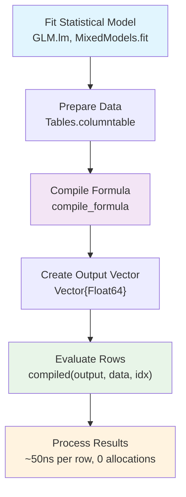
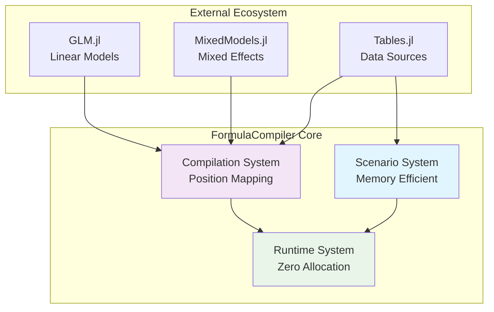
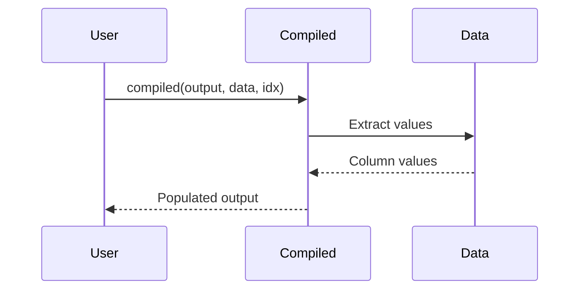

# GitHub Mermaid Test

Testing if diagrams render on GitHub.

## Simple User Workflow

## Simple System Architecture

## Basic Sequence

If these render as diagrams (not code blocks), then GitHub Mermaid is working!