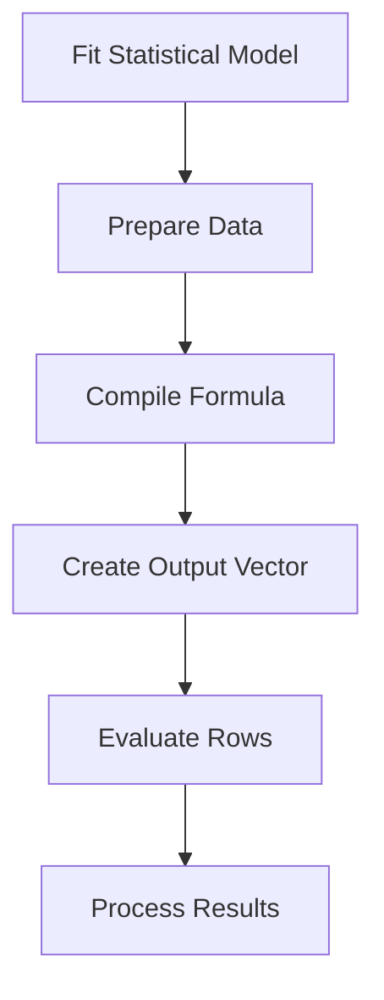
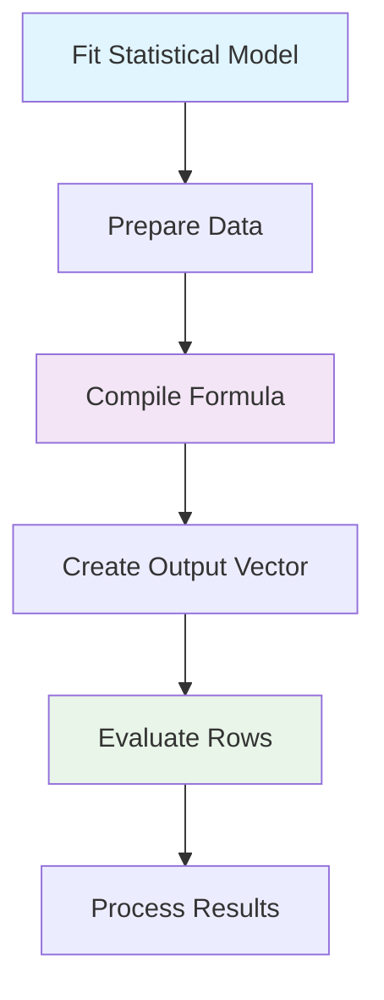

# Simple Diagram Test

## Minimal Working Example

## With Basic Styling

## Potential Issues I'm Checking:

1. **Too complex syntax**: Our diagrams might be too complex
2. **Annotation issues**: The dotted line annotations might not work
3. **Styling conflicts**: Multiple styling rules might conflict
4. **Subgraph complexity**: Complex nested subgraphs might break
5. **Repository settings**: GitHub might not have Mermaid enabled